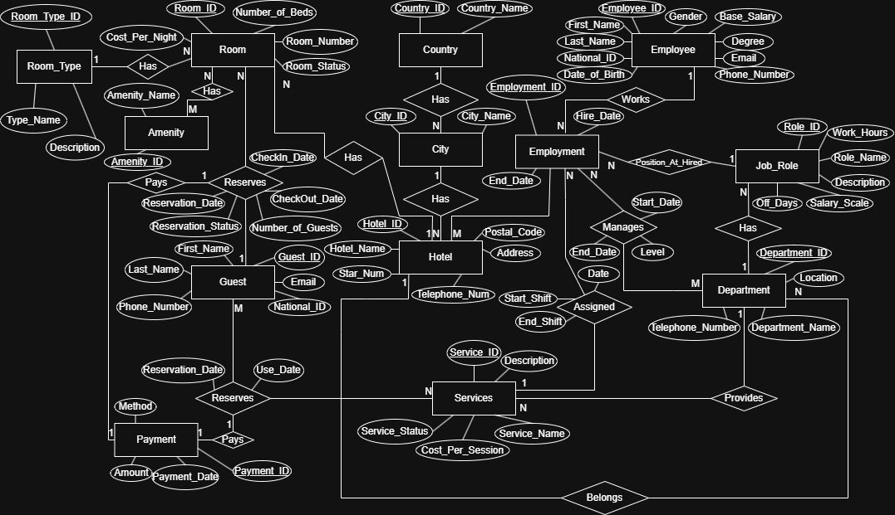

# 🏨 Hotel Management Database System

A fully normalized **Microsoft SQL Server** database design for managing a multi-hotel chain, featuring operational data (guests, rooms, reservations, employees, services) and built-in business intelligence views for revenue tracking, guest loyalty, and room type performance.

---

## 📋 Table of Contents
- [Overview](#-overview)
- [Schema Highlights](#-schema-highlights)
- [Features & Analytics](#-features--analytics)
- [Getting Started](#-getting-started)
- [Project Structure](#-project-structure)
- [ERD](#-erd)
- [Technologies Used](#-technologies-used)
- [Author](#-author)

---

## 🎯 Overview
This project simulates a real-world hotel chain management system. It handles:

- **Locations**: Countries, Cities, and 11 Hotel branches (Ferdosi, Azadi, Esteghlal, etc.).
- **Rooms**: Categorized by `RoomType` (Single, Double, Triple, Suite) with per-room nightly rates and status (Available/Occupied/Maintenance).
- **Guests & Reservations**: Full booking lifecycle (Booked → CheckedIn → CheckedOut / Cancelled), linked to Payments.
- **Employees & HR**: Job roles, departments, shift scheduling, and employment history.
- **Services**: Hotel amenities (Lobby Café, Security Patrol, Laundry, etc.) used by guests.

---

## 🗃️ Schema Highlights
- **Normalized Design**: Up to 3rd Normal Form (3NF).
- **Referential Integrity**: All foreign keys are enforced with cascading options where appropriate.
- **Business Logic Triggers**: 
  - `trg_HotelMatch` – Prevents assigning a Department Manager to a department in a different hotel.
  - `trg_ServiceEmployment_HotelMatch` – Prevents assigning an employee to a service outside their hotel.
- **Dynamic Views**: Instead of storing stale flags, values such as `Age` or `Active` are calculated dynamically.

---

## 📊 Features & Analytics
The database includes 3 pre-built analytical reports plus 3 views:

### Analytical Reports (`04_Analysis.sql`)
1. **Guest Spending Tiers** – Categorizes guests as `A`, `B`, or `C` based on total payments.
2. **Hotel Revenue Summary** – Total income and unique guest count per hotel.
3. **Room Type Popularity** – Displays room types ordered by cheapest available price, with total reservation counts.

### Advanced Views (`03_views.sql`)
1. **`EmployeeWithAge`** – Calculates accurate employee age considering whether their birthday has passed this year.
2. **`MonthlyHotelRevenue`** – Year/Month breakdown of revenue per hotel.
3. **`RoomTypeActivity`** – Per-hotel, per-room-type performance indicator (`Active = 1` if ≥ 2 bookings). This is a dynamic alternative to a static `Active` column.

---

## 🚀 Getting Started

### Prerequisites
- **Microsoft SQL Server** (2016+)
- **SQL Server Management Studio (SSMS)** or **Azure Data Studio**

### Installation
1. **Clone the repository**
   ```bash
   git clone https://github.com/Its-Fate/HotelManagement-DB.git
   ```

2. **Run the scripts in order** inside SSMS:
   - `Database/00_create_database.sql` – Creates the HotelManagement database.

   - `Database/01_create_tables.sql` – Creates all tables, constraints, and triggers.

   - `Database/02_seed_data.sql` – Inserts sample data (11 hotels, 20 employees, guests, etc.).

   - `Database/03_views.sql` – Creates analytical views.

   - `Database/04_Analysis.sql` – Provides some useful analysis.

---

## 📁 Project Structure
```HotelManagement-DB/
├── Database/
│   ├── 00_create_database.sql      # DB creation
│   ├── 01_create_tables.sql        # Schema + FKs + Triggers
│   ├── 02_seed_data.sql            # Sample data
│   ├── 03_views.sql                # Advanced analytics views
│   └── 04_Analysis.sql             # Business reports (Guest tiers, Revenue, Popularity)
├── Docs/
│   └── ERD.png                     # Entity-Relationship Diagram
├── .gitignore
├── LICENSE
└── README.md
```

---

## 🖼️ ERD


---

## 🛠️ Technologies Used
- T-SQL (SQL Server)
- SSMS
- Git & GitHub

---

## 👤 Author
**Fatemeh Akbari**  
 GitHub: [@Its-Fate](https://github.com/Its-Fate)  
 LinkedIn: [Fatemeh Akbari](https://linkedin.com/in/akbari7fatemeh)

---

## 📄 License
This project is open-source and available under the [MIT License](https://license).